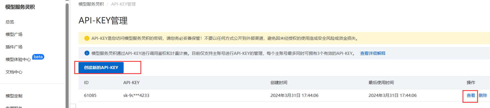

# 网络小说自动生成系统

## 项目背景

随着AI技术的发展,利用语言模型自动生成小说成为可能。本项目利用ChatGPT等预训练语言模型,结合人机对话的方式实现小说自动生成。

## 阿里云账号开通

1. 登录阿里云官网开通账号

2. 开通模型服务灵积


3.生成对应的api key


## 环境搭建

### 下载代码

```markdown
git clone https://github.com/franclyn-f/novel.git
```

### 安装依赖 

```markdown
pip install -r requirements.txt
```

### 设置APIkey

打开novel_chapter.py,设置DASHSCOPE_API_KEY环境变量，环境变量为上述灵积服务中的apikey

## 使用方法

### 执行主程序

```markdown
python novel_chapter.py
```

### 按交互提示输入内容

### 生成章节、总结并存档

## 执行效果

- 自动提出章节标题
- 按要求续写章节各个小节
- 生成指定格式的章节总结
- 每次运行生成一章内容
- 内容以对话的形式自动生成

## 文件目录
checkpoint目录
- chapter_num.txt 已完成的章节数
- summary.txt 之前章节的总结

novels目录
- 1.txt 存放第一章的内容
- 2.txt 存放第二章的内容 
- ...

## 执行示例


## 网页执行示例
```
cd src
streamlit run novel_web.py
```

## 运行截图
命令行界面如下


网页上打开localhost:8501


点击开始按钮，网页上会显示小说内容

